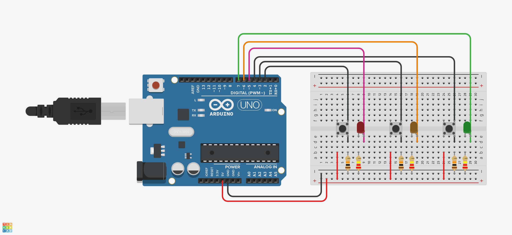

# 3 Buttons & 3 LEDs – Arduino Project

A simple Arduino project that controls 3 LEDs using 3 push buttons. Great for beginners to learn basic input/output and wiring.

---

## 🔧 Components

- 1× Arduino Uno or Nano  
- 3× LEDs  
- 3× Push buttons  
- 3× 220Ω resistors (for LEDs)  
- 3× 10kΩ resistors (for buttons)  
- 1× Breadboard  
- Jumper wires  

---

## 🔌 Circuit Diagram

---

## 🚦 How It Works

Each push button controls one LED:

- Press **Button 1** → **LED 1** turns ON  
- Press **Button 2** → **LED 2** turns ON  
- Press **Button 3** → **LED 3** turns ON  

Release the button and the corresponding LED turns OFF.
